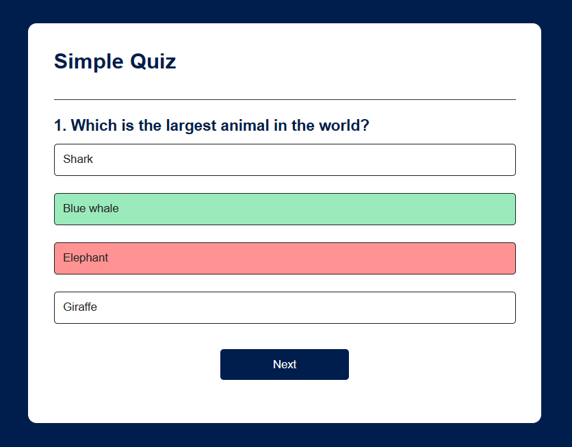
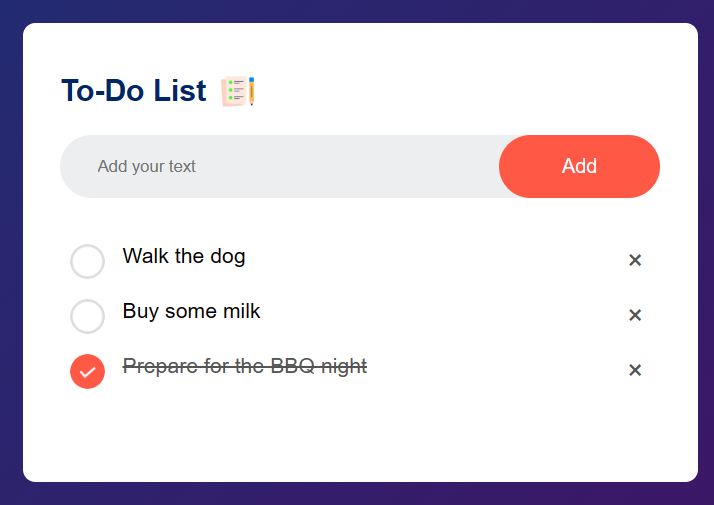
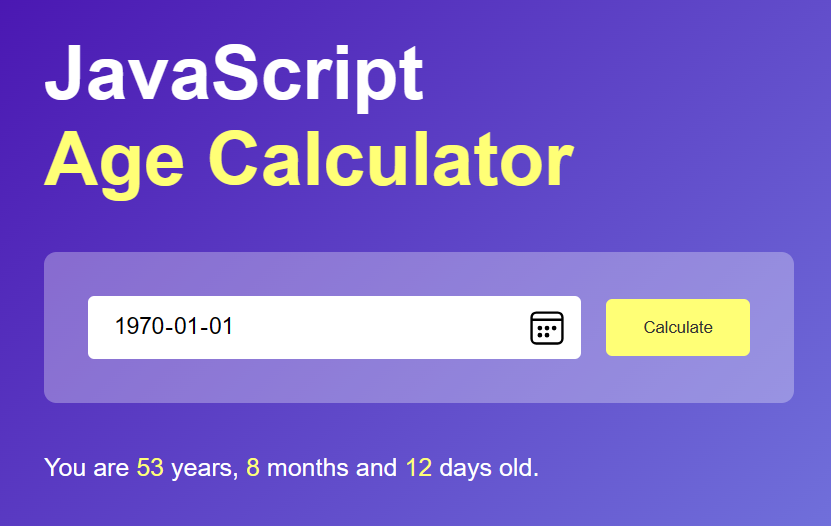
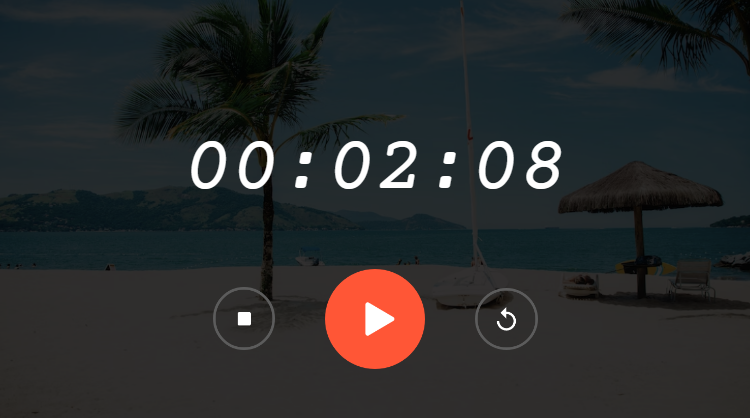
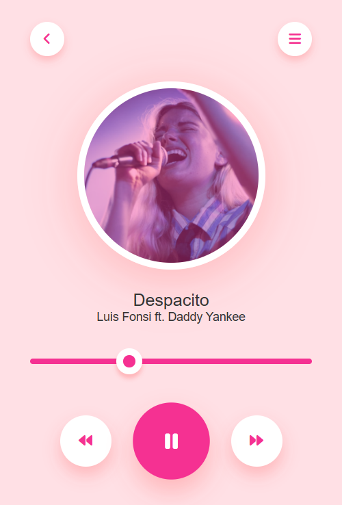
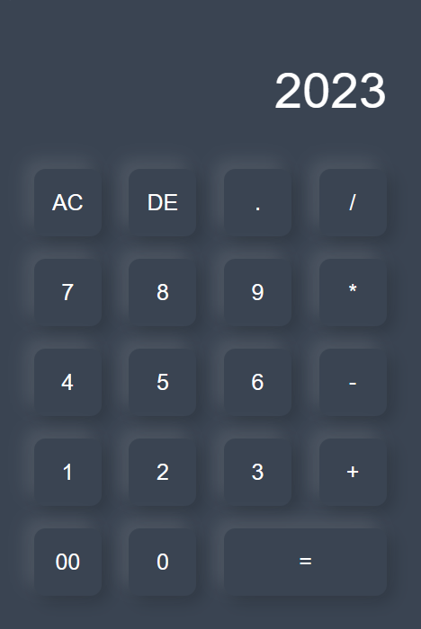
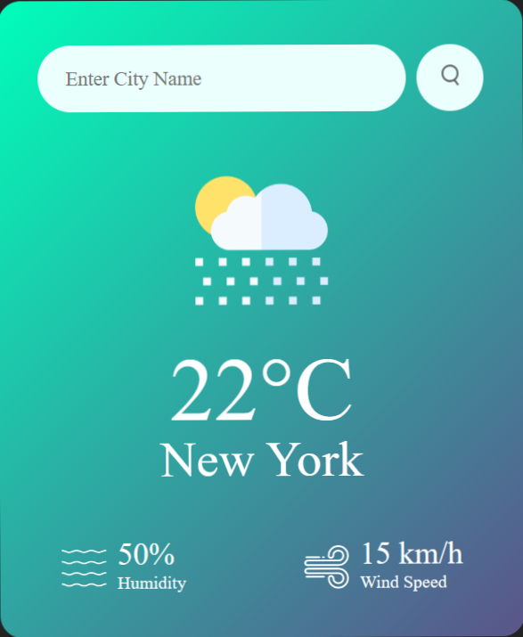
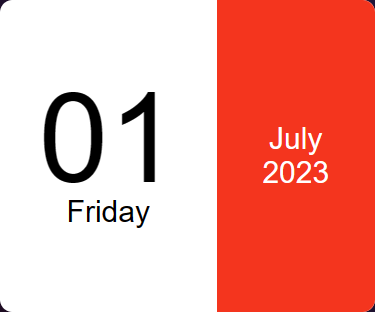
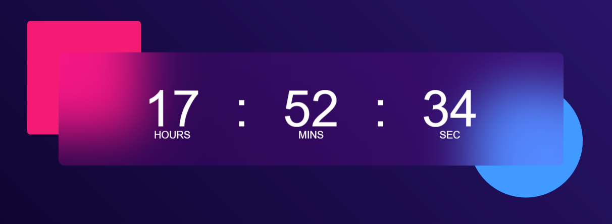
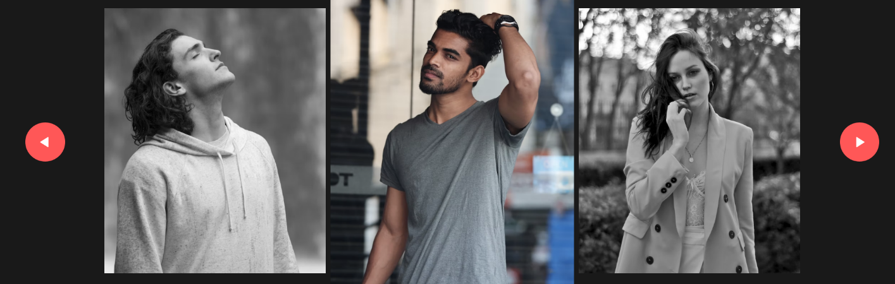

# Mini JS Applets

## About
10 mini standalone applets of mine built with vanilla JS which
are available to be used and configured easily/freely. Just
choose one that you like and use it for your own project!
 
## Gallery
| 
Centered Text
 | 
Centered Text
 |
| --- | --- |
|  |  |
| 
Centered Text
 | 
Centered Text
 |
|  |  |
| 
Centered Text
 | 
Centered Text
 |
|  |  |
| 
Centered Text
 | 
Centered Text
 |
|  |  |
| 
Centered Text
 | 
Centered Text
 |
|  |  |

## License

Copyright &#169; 2023 Meenbeese. All Rights Reserved.
